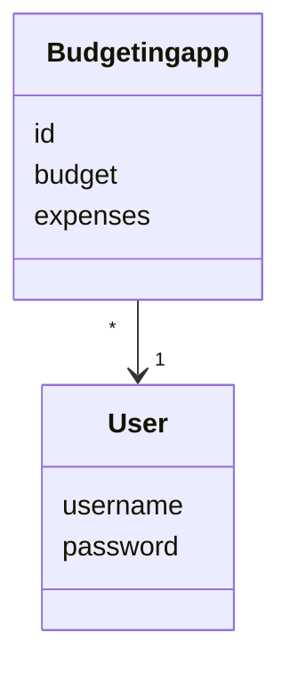

# Arkkitehtuurikuvaus

## Rakenne

## Sovelluslogiikka

Sovelluksen loogisen tietomallin muodostavat luokat Budgetingservice ja User, jotka kuvaavat käyttäjiä ja käyttäjien toimintoja:

Pakkauskaavio

