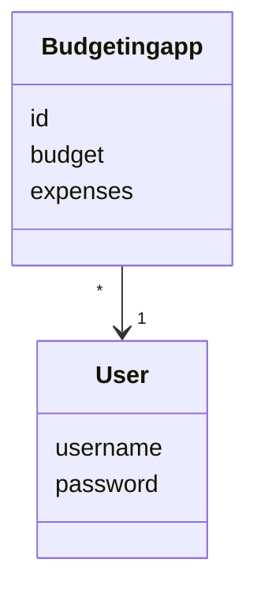
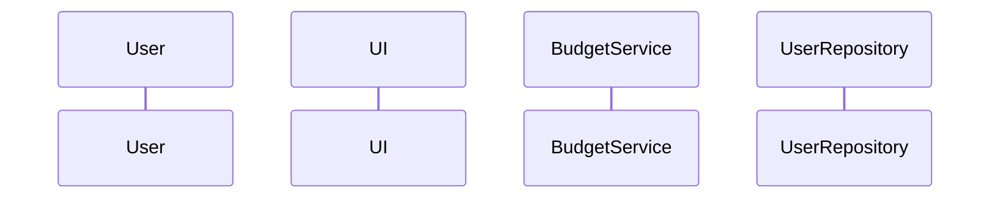

# Arkkitehtuurikuvaus

## Rakenne

Koodin pakkausrakenne on seuraava:

UI sisältää käyttöliittymän, budgetservice sisältää sovelluslogiikan, repositories sisältää koodin tiedontietokantaan tallentamiseen,
entities sisältää luokat, jotka määrittelevät sovelluksen tietokohteita.

## Käyttöliittymä

Käyttöliittymässä on viisi(5) eri näkymää

    - Sisäänkirjautuminen
    - Käyttäjän luominen
    - Budgetointi sovelluksen pää näkymä
    - Budgetin luominen
    - Budgetin tarkastelu

Jokaisesta näkymästä on luotu omat luokkansa. Yksi näkymistä on aina enintään näkyvillä. UI kutsuu ainoastaan budgetservice luokan metodeja.

Sovelluksen pää sivu päivittyy uuden budgetin luodessa, poistaessa tai toisen käyttäjän kirjautuessa.

## Sovelluslogiikka

Sovelluksen loogisen tietomallin muodostavat luokat Budgetingservice ja User, jotka kuvaavat käyttäjiä ja käyttäjien toimintoja:

Toiminnoista vastaa luokka BudgetingService olio. Luokka näyttää käyttäliittymän toiminnoille omat metodit, esim:

    login(username, password)
    create_budget(content)
    get_budgets()

Ohjelman kuvaavampi pakkauskaavio:

## Tietojen pysyväistallennus

Repositories hakemiston luokat BudgetingRepository ja UserRepository hoitavat tietojen tallettamisen. Luokat BudgetingRepository ja UserRepository tallentaa tiedot SQLite-tietokantaan.

Budgetit ja käyttäjät tallennetaan SQLite-tietokannan tauluihin budgets ja users, joka alustetaan [initialize_database.py](https://github.com/SamiKazan/Ohjelmistotekniikka/blob/master/src/initialize_database.py) tiedostossa.

## Päätoiminnot

Seuraavat sekvenssikaaviot kuvaavat sovelluksen logiikan osalta toiminnallisuudelta.

# Sisäänkirjautumisen sekvenssikaavio

# Budgtin luomisen sekvenssikaavio

# Budgetin poiston sekvenssikaavio

## Ohjelman rakenteeseen jääneet heikkoudet
  - Ohjelman käyttöliittymien metodit message ovat samat jokaisessa, joten siitä olisi voinut tehdä oma luokkansa.