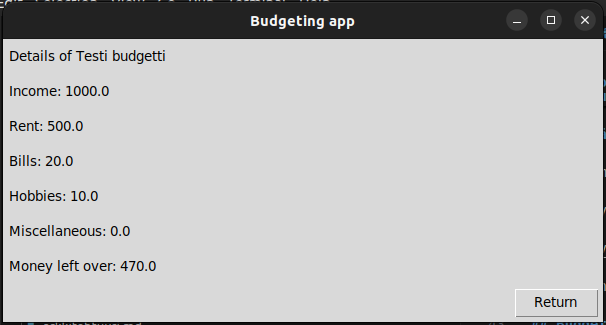

# Käyttöohje

Lataa projektin viimeisimmän -releasen- lähdekoodi.

## Ohjelman käynnistäminen

Asenna ohjelman riippuvuudet ennen käynnistystä komennolla:

```
poetry install
```

Tämän jälkeen tulee suorittaa alustustoiminto komennolla:

```
poetry run invoke build
```

Ohjelman voi nyt käynnistää komennolla:

```
poetry run invoke start
```

## Kirjautuminen

Sovelluksen käynnistäessä näkyy kirjautumisnäkymä:


Onnistunut kirjautuminen olemassaolevilla käyttäjätunnuksilla ja salasanalla ja painamalla "Login" vie päänäkymään.

## Käyttäjän luominen

Kirjautumisnäkymästä voi siirtyä käyttäjän luomisnäkymään painamalla "Don't have an account? Create one here".

Uuden käyttäjän voi luoda syöttämällä käyttäjänimi ja salasana ja painamalla "Create user".


Käyttäjän luomisen onnistuessa siirrytään käyttäjän budgeting sovelluksen päänäkymään

## Budgetin luominen, tarkastelu ja poisto

Onnistuneen kirjautumisen myötä siirrytään käyttäjän päänäkymään


Näkymästä voi luoda uuden budgetin painamalla "Create new budget", joka vie budgetin luonnin näkymään:


Täytettyään lomakkeen ja painamalla "Create budget" vie käyttäjän takaisin päänäkymään, josta voi poistaa ja tarkastella budgetin:


Painamalla budgetin painiketta "Details" vie käyttäjän tarkastelu näkymään, josta voi palata päänäkymään painamalla "Return":



Painamalla "Delete" budgetti poistetaan ja katoaa näkymästä.

Klikkaamalla  oikean ylänurkan painiketta "Logout" kirjaa käyttäjän ulos ja vie takaisin kirjautumissivulle.