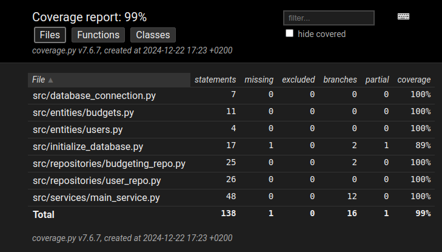

# Testausdokumentti

Ohjelmaa on testattu unittestilla.

## Yksikkö- ja integraatiotestaus

### Sovelluslogiikka

Sovelluslogiikan `BudgetingService`-luokkaa testataan [TestBudgetservice](https://github.com/SamiKazan/Ohjelmistotekniikka/blob/master/src/tests/services/main_service_test.py)-testiluokalla.

### Repositorio-luokat

Repositorio luokat `BudgetingRepository` ja `UserRepository` testataan [TestBudgetingRepo](https://github.com/SamiKazan/Ohjelmistotekniikka/blob/master/src/tests/repos/budgeting_repo_test.py) ja [TestUserRepo](https://github.com/SamiKazan/Ohjelmistotekniikka/blob/master/src/tests/repos/user_repo_test.py) testiluokilla.

### Testauskattavuus

Testien haarautumakattavuus on 99% ottamatta huomioon käyttöliittymän tiedostoja.

Testaamatta jäi osittain initialize_database.py-tiedosto. Testaamatta jäi väärintäytetyn testin luonti ja eri käyttäjä yrittää poistaa eri käyttäjän budgetin.

## Järjestelmätestaus

Järjestelmätestaus on tehty manuaalisesti.

### Asennus ja konfigurointi

Sovellus on testattu [käyttöohjeen](./kayttoohje.md) kuvaamalla tavalla Linux-ympäristössä.

### Toiminnallisuudet

[Määrittelydokumentin](./vaatimusmaarittely.md) ja käyttöohjeen listaamat toiminnot ovat käyty läpi. Kaikkien toiminnallisuuksien syötekentät on yritetty täyttää myös epämääräisillä arvoilla.

## Sovellukseen jääneet laatuongelmat

Testien suorittaessa alustetaan sama tietokanta, jota sovellus käyttää, eli kaikki tiedot mitä sinne on jo laitettu valitettavasti poistetaan.

Ei anna virhe ilmoitusta, jos tietokantaa ei ole alustettu.

Ei anna virhe ilmoitusta, jos budgetin luonti epäonnistuu.