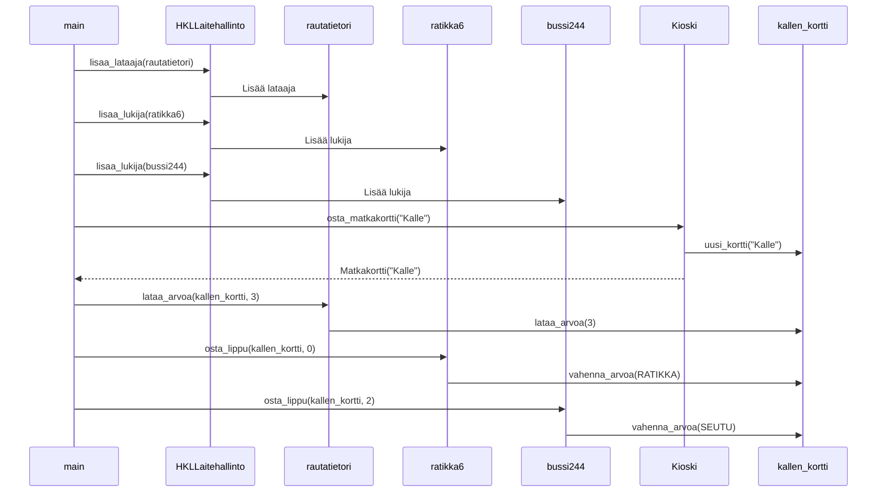

```mermaid
sequenceDiagram
    participant main
    participant HKLLaitehallinto
    participant Lataajalaite as rautatietori
    participant Lukijalaite1 as ratikka6
    participant Lukijalaite2 as bussi244
    participant Kioski
    participant Matkakortti as kallen_kortti

    main ->> HKLLaitehallinto: lisaa_lataaja(rautatietori)
    HKLLaitehallinto ->> Lataajalaite: Lisää lataaja
    main ->> HKLLaitehallinto: lisaa_lukija(ratikka6)
    HKLLaitehallinto ->> Lukijalaite1: Lisää lukija
    main ->> HKLLaitehallinto: lisaa_lukija(bussi244)
    HKLLaitehallinto ->> Lukijalaite2: Lisää lukija

    main ->> Kioski: osta_matkakortti("Kalle")
    Kioski ->> Matkakortti: uusi_kortti("Kalle")
    Kioski -->> main: Matkakortti("Kalle")

    main ->> Lataajalaite: lataa_arvoa(kallen_kortti, 3)
    Lataajalaite ->> Matkakortti: lataa_arvoa(3)

    main ->> Lukijalaite1: osta_lippu(kallen_kortti, 0)
    Lukijalaite1 ->> Matkakortti: vahenna_arvoa(RATIKKA)

    main ->> Lukijalaite2: osta_lippu(kallen_kortti, 2)
    Lukijalaite2 ->> Matkakortti: vahenna_arvoa(SEUTU)

```
